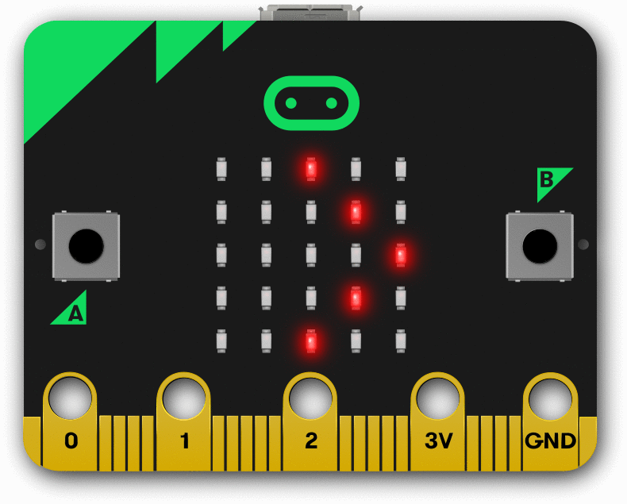

# Robótica en BiblioMaker

### Febrero 2020

## José Antonio Vacas @javacasm

## https://github.com/javacasm/RoboticaBiblioMaker

Este curso ofrece a los asistentes conocer y utilizar nuevas herramientas para aprender la programación y la robótica. Podrá conocer diferentes tipos de robot y trabajar con las placas más actuales, además de familiarizarse con un primer lenguaje de programación de fácil uso a través de bloques gráficos.

## Objetivos

- Conocer las posibilidades de la programación y la robótica.
- Mostrar  las ventajas del uso herramientas tales como la programación y la robótica.
- Dar a conocer diferentes tipos de robot y familiarizarse con las placas actuales y algunos complementos.

## Contenidos

0. [Índice](./Indice.md)
1. [Introducción a la robótica](./IniciacionRobotica.md). 
    Placas para trabajar la robótica.
    Tutorial de uso. 
    Trabajando las materias STEAM con la robótica
2. Robótica sencilla
	1. Sensores
	2. Control de motores: temperatura, luz y sonido
	3. Midiendo distancias
	4. Maniobras:
		* No te caigas 
		* Siguelíneas
		* Aparcamiento
		* Sígueme
3. Ejemplos de algunos proyectos sencillos
4. Exposición de proyectos realizados

Ejemplo de robot a usar

# [Complementos](./Complementos.md)

# [Recursos](./Recursos.md)

